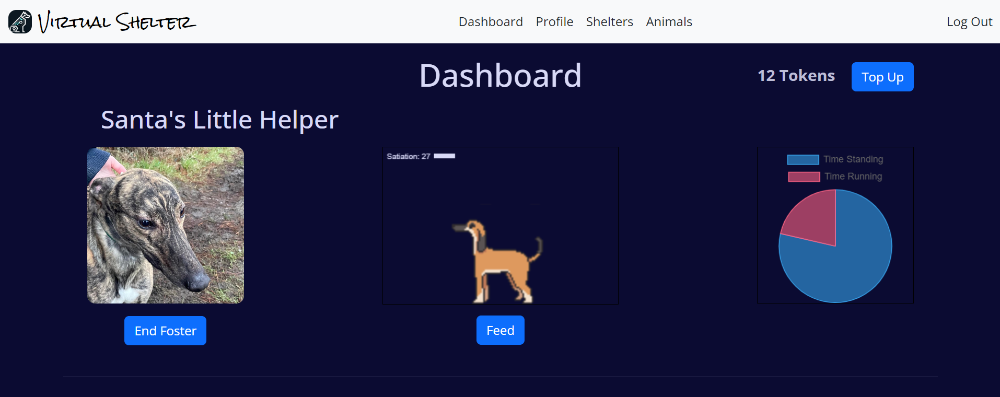

# Milestone 4 Project - Virtual Shelter
By Gareth Llewelyn

[View deployed Heroku site](https://virtual-shelter-0dec942891ea.herokuapp.com/)



# Table of contents

> 1. [Overview](#overview)
> 2. [UX](#ux)
>> 1. [Strategy](#strategy)
>> 2. [Scope](#scope)
>> 3. [Structure](#structure)
>> 4. [Skeleton](#skeleton)
>> 5. [Surface](#surface)
> 3. [Features](#features)
>> 1. [Existing Features](#existing-features)
>> 2. [Future Feature Considerations](#future-feature-considerations)
> 4. [Technologies Used](#technologies-used)
> 5. [Testing](#testing)
> 6. [Deployment](#deployment)
> 7. [Credits](#credits)
> 8. [Acknowledgements](#acknowledgements)
> 9. [Disclaimer](#disclaimer)

# Overview

[Back to top](#milestone-4-project---virtual-shelter)

Virtual Shelter is an app where animal rescue shelters can upload profiles of their animals for users to virtually foster them and contribute to their care.

# UX

[Back to top](#milestone-4-project---virtual-shelter)

## Strategy

[Back to top](#milestone-4-project---virtual-shelter)

Creator's goals...

- to create an additional income stream for animal shelters

User's goals...

- to be able to support a shelter that's important to them
- to enjoy the challenge of fostering a virtual animal in an emotionally engaging way

### User Stories

| User Story ID                        | As A(n)       | I want to be able to                                   | so that I can                                     |
| ------------------------------------ | ------------- | ------------------------------------------------------ | ------------------------------------------------- |
| **Viewing and Navigation**           |               |                                                        |                                                   |
| 1a                                   | Visitor       | Understand the purpose of the site immediately         | Decide whether I want to engage with it.          |
| 1b                                   | User          | Navigate and interact with the site on all viewports   | Engage with the site on any device.               |
| 1c                                   | User          | View information about the site                        | Understand how to use it.                         |
| **User Authentication and Profiles** |               |                                                        |                                                   |
| 2a                                   | Visitor       | Create an account                                      | Access the features of the web app.               |
| 2b                                   | User          | Log in                                                 | Access my profile and interact with the app.      |
| 2c                                   | User          | Log out                                                | Secure my account after use.                      |
| 2d                                   | User          | Reset my password if I forget it                       | Regain access to my account.                      |
| 2e                                   | User          | Update my profile details                              | Keep my information current.                      |
| 2f                                   | User          | Delete my account                                      | Delete information related to me if I so wish.    |
| 2g                                   | Shelter admin | Register as a shelter admin                            | List my shelter and animals on the site.          |
| 2h                                   | Admin         | Manage user accounts and shelter profiles              | Maintain the integrity of the platform.           |
| **Animal Shelter Management**        |               |                                                        |                                                   |
| 3a                                   | Shelter admin | Update shelter profile                                 | Keep my shelter's details current.                |
| 3b                                   | Shelter admin | Add animal profiles to the shelter's profile           | Facilitate their virtual fostering.               |
| 3c                                   | Shelter admin | Update animal profiles                                 | Keep information about them accurate and current. |
| 3d                                   | Shelter admin | Delete animal profiles                                 | Remove animals that are adopted.                  |
| 3e                                   | Shelter admin | Send updates about the animals to their fosterers      | Keep them connected and informed.                 |
| **Virtual Fostering**                |               |                                                        |                                                   |
| 4a                                   | User          | Browse animals available for virtual fostering         | Choose one to support.                            |
| 4b                                   | User          | Virtually foster an animal                             | Support it through the platform.                  |
| 4c                                   | User          | Interact with a virtual animal                         | Simulate taking care of it.                       |
| 4d                                   | User          | Receive updates on the real animal I am fostering      | Be informed about its well-being.                 |
| **Payments and Sponsorship**         |               |                                                        |                                                   |
| 5a                                   | User          | Make secure payments                                   | Support the shelter.                              |

## Scope

[Back to top](#milestone-4-project---virtual-shelter)

### Functional Requirements

#### Simple and intuitive interface

- Users can navigate through the site easily
- Users get feedback and confirmation for their actions
- Users can use site on a range of device sizes

#### Profile management

- Users can register, login, logout and edit profile
- Users can request to be made a Shelter Admin
- Shelter Admins can manage a shelter's profile
- Shelter Admins can upload and manage animal profiles
- Shelter Admins can provide updates on animal profiles

#### Virtual fostering

- Users can browse animal profiles to choose which to virtually foster
- Users can customize their own virtual animal from a choice of breeds and colours

#### Dashboard

- Users can view fostered animals
- Users can take care of fostered animals
- Users can assess animal stats
- Dashboard should update 'live'

#### Tokens

- Users can purchase tokens securely via Stripe
- Users can spend tokens on their fostered animals

### Content Requirements

#### Media

- Users can upload pictures for profiles

#### Sprite Sheets

- A variety of sprite sheets for different animals and colours

#### Game play

- Sprites will have multiple states to boost interactivity
- Users can interact with sprite via button(s)
- Sprite stats will be shown and updated live

## Structure

[Back to top](#milestone-4-project---virtual-shelter)

### UX Information Structure

Logged in users will have the following navbar links: Virtual Shelter(Home), Dashboard, Profile/My Shelter, Shelters, Animals, Log Out. This will enable users to care for their fostered animals, manage their personal information and browse shelters and animals in need of support.

### Application Information Flow

As the dashboard needs to update itself 'live' and when accessed after extended periods of disuse, this project requires the use of AJAX to connect the front end to the backend.

## Skeleton

[Back to top](#milestone-4-project---virtual-shelter)

### Wireframes

[Home page wireframe](static/wireframes/home-wireframe.png)

[Dashboard page wireframe](static/wireframes/dashboard-wireframe.png)

[Shelters page wireframe](static/wireframes/shelters-wireframe.png)

[Animals page wireframe](static/wireframes/animals-wireframe.png)

### Database

Drawn with [Lucid Chart](www.lucidchart.com)


## Surface

[Back to top](#milestone-4-project---virtual-shelter)

### Logo and favicon

I asked GPT-4 to create the logo. The then used a favicon generator to create the favicon images and link tags.


### Colour palette

This is the colour palette I chose.


### Fonts

The fonts are from Google Fonts. The logo text and home page title use Rock Salt, and the rest is Open Sans.

# Features

[Back to top](#milestone-4-project---virtual-shelter)

## Existing Features

[Back to top](#milestone-4-project---virtual-shelter)

### Website Structure

Bootstrap provides elements such as the navbar, grid layouts and carousels, and also manages screen size responsiveness.

### Accounts and Profiles

Account management is enabled by the django-allauth package. This handles registration, confirmation emails, login, logout and forgotten password, verification.

When a User is created, a signal is sent to create a Profile for that user. Profiles hold information such as role (User or Shelter Admin) and token count.


The user can view, update and delete their profile. On the Profile page, there is a link to 'Register Shelter'. This provides a form to collect information about the charity. Upon submission, a signal triggers an email to the Superuser informing them of the request. The Superuser can then navigate to the site admin interface, review the request information and decide whether to approve or reject it. If approved, the user's profile role will be updated to that of Shelter Admin, and a signal will trigger an email to inform the request sender!!!!


A Shelter Admin will see a navbar option of 'My Shelter' in place of 'Profile'. 


The Shelter Admin can 'Edit Profile', 'Delete Profile' and 'Add Animal' to the shelter profile.


An animal profile can be added to a shelter, and collect information such as a picture upload, name, species, breed, age, description and adoption status. Animal profiles can be edited and deleted. The Shelter Admin can also 'Add Update' about the dog to its profile. 


Users can choose to 'Foster' the animal.


### Sprite Creation and Customization

If the user chooses to foster an animal, they will be taken to a sprite creation page. Here a the user will be able to select the breed and colour of the animal from the available options.


The user can delete the sprite or 'return to shelter'.

### Dashboard

For each animal, the user will see some details of the real animal, including a picture, the animated sprite canvas, an interact button, and a dynamic chart canvas that tracks the sprite's activity.

The dashboard will update 'live' (once per minute, this might vary more on deployed site) without having to refresh the page.

The sprite's state will change depending on its satiation level. (Below 50 => standing, else running).

The user can feed the sprite if enough tokens are available.


### Tokens

Tokens can be bought via a link to a Stripe hosted checkout page. Upon successful 'payment', the user will be redirected to the dashboard with a toast message informing the user of the outcome. 


A webhook will update the number of tokens associated with a user's profile.

### Shelters and Animals Pages

Users will be able to browse through shelter and animals profiles on these pages.


## Future Feature Considerations

[Back to top](#milestone-4-project---virtual-shelter)

# Technologies Used

[Back to top](#milestone-4-project---virtual-shelter)

## Development

- VSCode - Development environment
- Google Chrome Dev Tools - Debugging and analysis
- GitHub - Code repository and version control
- Windows PowerShell - Terminal
- Virtual environment
- GPT-4 - Debugging, guidance

## HTML/CSS

- HTML5
- CSS3
- Bootstrap 5
- FontAwesome
- Google Fonts

## Python

- Python 3.12.1
- Django 5.1 - Framework
- Django-allauth - Authentication
- Stripe - Payment service
- Pillow - Image tool
- Boto3 - AWS management
- gunicorn - WSGI HTTP server
- Psycopg2 - Postgres DB adapter

List of packages

## JavaScript

- JavaScript ES6
- Jest - Testing
- Chart.js - Dynamic charts

## Testing Technologies

- W3C HTML Markup Validator
- W3C Jigsaw CSS Validator
- JSHint - JS validator
- Pylint - Python validator
- WebAIM - Accessibility
- Chrome Dev Tools Lighthouse - Performance, accessibility, SEO, best practices

## Hosting

- CDNs (Bootstrap, Chart.js)
- Heroku - App deployment platform
- AWS S3 - Media file hosting

## Images

- [Font Awesome](https://fontawesome.com/) - Icons
- [ImageResizer.com](https://imageresizer.com/image-compressor) - Image compressor
- [favicon.io](https://favicon.io/favicon-converter/) - png to favicon generator

## Database

- PostgreSQL - Relational database

# Testing

[Back to top](#milestone-4-project---virtual-shelter)

See [TESTING.md](TESTING.md) for testing documentation.

# Deployment

[Back to top](#milestone-4-project---virtual-shelter)

## Deployment to Heroku

This project was deployed to Heroku via the following steps...

### Initial Deployment

1) Sign in to your Heroku account, having created one.
2) Click 'Create new app'.
3) Enter app name and region.
4) Click 'Create app'.
5) In the 'Deploy' tab, in the 'Deployment method' section, select the 'GitHub' option.
6) In the 'Connect to GitHub' section below, search for the relevant code repository and click 'Connect'.

### Automatic Deployment

Automatic deployment was enabled such that whenever the GitHub repository is updated, the new code would automatically update the Heroku app. This was set up as follows...

7) Still on the Deploy tab, in the 'Automatic deploys' section, click 'Enable Automatic Deploys'.

### Environment Variables

These environment variables must be set on Heroku for the app to work. 

8) On the Settings tab, in the 'Config Vars' section, click 'Reveal Config Vars'.
9) Enter the following variables:

- AWS_ACCESS_KEY_ID
- AWS_SECRET_ACCESS_KEY
  - These keys can be obtained by creating an S3 Bucket on AWS.
- DATABASE_URL
  - This was obtained from a PostgreSQL data base provided by Code Institute.
- EMAIL_HOST_PASS
- EMAIL_HOST_USER
  - The email address and password for an email account.
- SECRET_KEY
  - For cryptographic purposes in Django.
- STRIPE_PUBLIC_KEY
- STRIPE_SECRET_KEY
- STRIPE_WH_SECRET
  - These keys can be obtained by creating a Stripe account.
  - In the dashboard, click 'Developers'.
  - Under 'API keys', you will find your Public and Secret keys.
  - Under 'Webhooks', click 'Add endpoint'.
  - For the URL, put DOMAIN + 'profiles/stripe-webhook/'
  - Under 'Select events to listen to', click '+ Select events'.
  - Tick 'Select all events' then press 'Add events'.
  - Set the STRIPE_WH_SECRET as the Signing Secret generated as a result.
- USE_AWS
  - Set as True.

### Database Migration

10) Open the Heroku Terminal and run the following command to migrate the database schema.

- `heroku run python manage.py migrate`

## Local Deployment

### Cloning the Repository

1) Go to the project's GitHub repository.
2) Click the 'Code' dropdown and copy the HTTPS link.
3) Create a local directory to keep the repository. 
4) In the terminal of your IDE, ensure your IDE supports git, such as by running 
 - `git init`.
5) In the terminal, use the copied link in the following command
- `git clone https://github.com/LlewBach/virtual-shelter.git`

### Local Setup

6) Create a Python [Virtual Environment](https://docs.python.org/3/tutorial/venv.html) and activate it.
7) To install the required packages, run
- `pip3 install requirements.txt`
8) To migrate the database, run
- `python manage.py migrate`
9) Open the directory in your IDE.
10) Create a file called 'env.py' in the 'virtual_shelter' folder.
11) In this file, provide the local environment variables. Here is a template.

```python
import os

os.environ.setdefault("SECRET_KEY", "your own value")
os.environ.setdefault("DEVELOPMENT", 'True')
os.environ.setdefault("EMAIL_HOST_PASS", "your own value")
os.environ.setdefault("EMAIL_HOST_USER", "your own value")

os.environ.setdefault("STRIPE_PUBLIC_KEY", 'your own value')
os.environ.setdefault("STRIPE_SECRET_KEY", 'your own value')
os.environ.setdefault("STRIPE_WH_SECRET", 'your own value')
```

# Credits

[Back to top](#milestone-4-project---virtual-shelter)

## README

- Ben Kavanagh - I referred to the README of my mentor, Ben Kavanagh, to structure my own.

## Media

### Unsplash Images
- [Margarita Kosior](https://unsplash.com/photos/white-and-brown-short-coated-dog-standing-on-brown-field-during-daytime-WVGGBALwXPE)

### Sprite Sheets
- [GirlyPixels](https://girlypixels.itch.io/) - The creator of the purchased spritesheets.

### Logo and favicon
- GPT-4

## Code

### GPT-4

Helped with / taught me about the following:
- Debugging errors
- How to use Django signals and forms
- How to go implement AJAX fetch requests
- Formatting the Chart.js pie chart
- Setting up the Stripe webhook view
- Testing
- Writing docstrings

### YouTube

- Web Dev Creative - [How To Make Responsive Navbar with Bootstrap 5 | Step by Step Tutorial](https://www.youtube.com/watch?v=zOtxP7ahi4M)

- Lun Dev Code - [How To Make Toast Notification In Javascript](https://www.youtube.com/watch?v=6XRmvSdTvMo)
  - This is how I made my toasts, with only small changes by myself.

# Acknowledgements

[Back to top](#milestone-4-project---virtual-shelter)

I would like to thank my mentor Ben Kavanagh for his guidance and support with this project and my year on this Web Application Development diploma with Code Institute.

# Disclaimer

[Back to top](#milestone-4-project---virtual-shelter)

This website is for educational purposes only. The Stripe account will therefore remain in Test Mode. The animal profiles are fictitious.