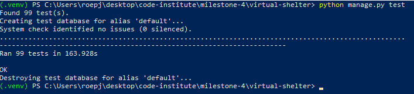
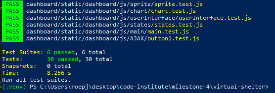

# Virtual Shelter - Testing Documentation

The README can be found under [README.md](README.md)

# Table of contents

> 1. [User Story Testing](#user-story-testing)
> 2. [Unit Testing](#unit-testing)
> 3. [Responsiveness Testing](#responsiveness-testing)
> 4. [Browser Testing](#browser-testing)
> 5. [Code Validation](#code-validation)
> 6. [Significant Bugs](#significant-bugs)

# User Story Testing

[Back to top](#virtual-shelter---testing-documentation)

US1a - "As a visitor, I want to understand the purpose of the site immediately	so that I can decide whether I want to engage with it".

AC1a - "User must be able to identify the website's name, understand its purpose on the first visit, and understand what is possible".

1. Navigate to the website in the Chrome browser.
2. Check that the site name (Virtual Shelter) and navbar are clearly visible.
3. Check that the main message ("Foster a virtual animal...to help a real one") is visible.
4. Check that the site info below is visible.

Test result: Pass

US1b - "As a user, I want to navigate and interact with the site on all viewports, so that I can engage with the site on any device".

AC1b - "A user should be able to use the site on any device".

The testing for responsive design can be seen in the Responsiveness Testing section.

US1c - "As a user, I want to view information about the site, so that I can understand what I can do with it".

AC1c - "A user should be able to see what is the user can do with the site from the home page".

1. Navigate to the website in the Chrome browser.
2. Check that the information about the site is visible on the home page.

Test result: Pass

US2a - "As a visitor, I want to create an account, so that I can access the features of the web app".

US2b - "As a user, I want to log in, I want to access my profile and interact with the app".

US2c - "As a user, I want to be able to log out, so that I can secure my account after use".

AC2 a/b/c - "Users must be able to register, log in and log out".

1. Navigate to the website in the Chrome browser.
2. Click the 'Register' option in the navbar.
3. Enter account details and click 'Sign Up!'.
4. Open email inbox and click the confirmation link from Virtual Shelter.
5. In the opened tab, click to confirm the email address.
6. Log in with username and password.
7. A toast message should confirm that you have successfully signed in.
8. Click 'Log Out' in the navbar.
9. On the sign out confirmation page, click 'Sign Out'.
10. A toast message should confirm that you have successfully signed out.

Test result: Pass

US2d - "As a user, I want to be able to reset my password if I forget it, so that I can regain access to my account".

AC2d - "User must be able to reset password if forgotten".

1. As a logged out user, navigate to the site's Sign In page.
2. Click 'Forgot your password?'.
3. Enter email address and click 'Reset My Password'.
4. Open the inbox for the above email address.
5. Find the email titled 'Password Reset Email' and click the reset link therein.
6. Enter new password twice and click 'Change Password'.
7. A toast message should say that the password was successfully changed.
8. Log in with new password.

Test result: Pass

US2e - "As a user, I want to update my profile details, so that I can keep my information current".

AC2e - "User can add/update profile image and bio".

1. Having logged in, navigate to the profile page.
2. Click 'Edit Profile'.
3. Upload an image and write 'Test bio' in the Bio box.
4. Click 'Save Changes'.
5. The user should be redirected to the profile page which displays the uploaded image and text 'Test bio'.

Test result: Pass

US2f - "As a user, I want to delete my account, so that I can delete information related to me if I so wish".

AC2f - "User can delete account".

1. Having logged in, navigate to the profile page.
2. Click 'Delete Profile'.
3. In the modal pop up, click 'Confirm'.
4. A toast message should confirm that the profile was successfully deleted.
5. The user should be logged out.

Test result: Pass

US2g - "As a shelter staff member, I want to register as a shelter admin, so that I can list my shelter and animals on the site".

AC2g - "User can apply to become a shelter admin, and upon request approval, will be able to manage a shelter profile".

1. Log in as a normal User.
2. Navigate to the profile page.
3. Click 'Register Shelter'.
4. Enter the following information:
  - Charity name - Greyhound Trust
  - Charity registration number - 10101
  - Charity website - https://www.greyhoundtrust.org.uk/
  - Charity description - Greyhound shelter
5. Click 'Submit'.

6. Log out and log in as a superuser.
7. Navigate to the admin panel (site URL/ + admin/)
8. Under the 'PROFILES' section, click 'Role change requests'.
9. Tick the request with 'Greyhound Trust' as the 'CHARITY NAME'.
10. Select 'Approve requests' from the 'Action: ' dropdown.
11. Click 'Go'.
12. The request's status should have changed from 'Pending' to 'Approved'.
13. Log out.

14. Log in with the details of the previous normal User.
15. Navigate to the 'My Shelter' page from the navbar.
16. User should be able to see the shelter's details already loaded into the profile page.

Test result: Pass

US2h - "As the site admin, I want to manage user accounts and shelter profiles, so that I can maintain the integrity of the platform".

AC2h - "Superuser can log into the Django admin panel".

1. Log in as the super user.
2. Navigate to https://virtual-shelter-0dec942891ea.herokuapp.com/admin/
3. The Django administraion panel should be visible.

Test result: Pass

US3a - "As a shelter admin, I want to update shelter profile, so that I can keep shelter's details current".

AC3a - "Shelter admin must be able to update the shelter's profile".

1. Log in as a Shelter Admin.
2. Navigate to 'My Shelter'.
3. Click 'Edit Profile'.
4. Adjust the current information and click 'Save Changes'.
5. A toast message should confirm the profile was successfully updated.
6. The updated details should be visible on the profile page.

Test result: Pass

US3b - "As a shelter admin, I want to add animal profiles to the shelter's profile, so that I can facilitate their virtual fostering".

AC3b - "Shelter admin must be able to add animal profile".

1. Log in as a shelter admin.
2. Navigate to the 'My Shelter' page.
3. Click 'Add Animal'.
4. Upload image and information, then click 'Add Animal'.
5. A toast message should confirm that the profile was successfully created.
6. On the 'My Shelter' page, the new animal's profile should be visible in the shelter's 'Animals' section.
7. Click on the new animal's name.
8. The user should be able to see the animal's profile.
9. Click the 'Animals' option from the navbar.
10. The new animal should be listed with all the other animals.

Test result: Pass

US3c - "As a shelter admin, I want to update animal profiles, so that I can keep information about them accurate and current".

AC3c - "Shelter admin can update the profile of an animal that belongs to the associated shelter".

1. Log in as a Shelter Admin.
2. Navigate to the 'My Shelter' page.
3. Choose an animal, and click on it's 'Edit' button.
4. Adjust the animal's information and click 'Save'.
5. A toast message should display and confirm the details have been saved.
6. The updated information should be visible on the animal's profile.

Test result: Pass

US3d - "As a Shelter Admin, I want to delete animal profiles, so that I can remove animals that are adopted".

AC3d - "Shelter admin must be able to delete animal profiles".

1. Log in as a Shelter Admin.
2. Navigate to the 'My Shelter' page.
3. Choose an animal, and click on it's 'Delete' button.
4. On the modal pop up, click 'Delete Profile'.
5. A toast message should confirm the animal's profile was deleted.
6. The animal's profile should have disappeared from the My Shelter page.

Test result: Pass

US3e - "As a shelter admin, I want to send updates about the animals to their fosterers, so that I can keep them connected and informed".

AC3e - "Shelter admin must be able to add update to an animal's profile".

1. Log in as a Shelter Admin.
2. Navigate to the 'My Shelter' page.
3. If necessary, add an animal profile.
4. Click on the animal to go to its profile.
5. On its profile, click 'Add Update'.
6. Enter 'Test update' in the text box.
7. A toast message should confirm that an update was added.
8. On the animal's profile, the new update should be visible under the 'Updates' section.

Test result: Pass

US4a - "As a user, I want to browse animals available for virtual fostering, so that I can choose one to support".

AC4a - "User can browse through all animals and view individual profiles".

1) As a logged out user, click on the 'Animals' navbar option.
2) Choose an animal and click on its name.
3) User should be taken to that animal's profile.

Test result: Pass

 US4b - "As a user, I want to virtually foster an animal, so that I can support it through the platform".

 AC4b - "User can foster an animal and be able to manage it on the dashboard".

 1. As a logged in User (not Shelter Admin), navigate to the 'Animals' page.
 2. Choose an animal whose status is 'Available' and click its name.
 3. Click 'Foster'.
 4. On the Select Sprite page, choose a Breed and Colour then click 'Submit'.
 5. A toast message should confirm that the animal is fostered.
 6. On the dashboard, the animal and associated sprite should be visible.
 7. After approximately one minute, the chart should display.

Test result: Pass

US4c - "As a user, I want to interact with a virtual animal, so that I can simulate taking care of it".

AC4c - "User can 'feed' the sprite, view state change and stats on activity times".

1. Click the 'Top Up' button at the top of the dashboard.
2. On the Tokens page, click 'Buy'.
3. On the Stripe-hosted checkout page, fill out following information:
  - Email - test@test.com
  - Card information - 4242 4242 4242 4242, 12/34, 123
  - Cardholder name - Test
  - Postcode SA5 8AR
4. Click 'Pay'.
5. On the dashboard, choose an animal to 'feed'.
6. Click on the 'Feed' button below its sprite.
7. Feed the sprite until it has a satiation of 50 or just above.
8. The sprite should be running.
9. Wait until the satiation drops below fifty. (1% = 1 min)
10. The sprite should be standing.
11. The state tracker chart should automatically update live to reflect the time spent in each state.

Test result: Pass

US4d - "As a user, I want to receive updates on the real animal I am fostering, so that I can be informed about its well-being.

AC4d - "A shelter admin has to be able to upload updates about the animal which are visible on its profile page".

1. Having logged in as a shelter admin, click on the My Shelter navbar option.
2. Click on an animal's profile. If none exist, create an animal profile.
3. Select 'Add Update'.
4. Write a brief test text in the textbox.
5. Click 'Add Update'.
6. On the animal's profile, the update should be visible on the animal's profile page, under the 'Updates' section.

Test result: Pass

US5a - "As a user, I want to make secure payments, so that I can support the shelter".

AC5a - "User can buy tokens from a Stripe-hosted checkout page".

This was also tested in test 4c.

Test result: Pass

# Unit Testing

[Back to top](#virtual-shelter---testing-documentation)

This project was developed with unit testing.

## Python

### Python test coverage

## JavaScript

### JavaScript test coverage

# Responsiveness Testing

[Back to top](#virtual-shelter---testing-documentation)

xxx

# Browser Testing

[Back to top](#virtual-shelter---testing-documentation)

xxx

# Code Validation

[Back to top](#virtual-shelter---testing-documentation)

xxx

# Significant Bugs

[Back to top](#virtual-shelter---testing-documentation)

## Inconsistent spritesheet frame dimensions

Fixed: Yes

The spritesheet frame dimensions vary not only between dogs and colours, but also states within the same dog and colour! The consequence of this if left unresolved would be glitchy sprite animations. After contacting the creator to ask if the frames could be made a consistent size, she told me that this was her first time making spritesheets and that the answer was basically no. After consideration, I realised I could solve this by setting sprite.width by conditional statements based on the url passed into the Game class instantiation. See dashboard/static/dashboard/js/states/states.js.